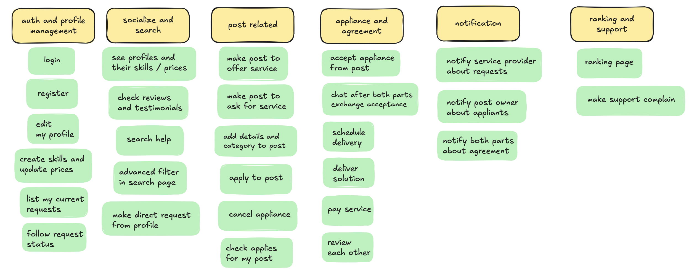
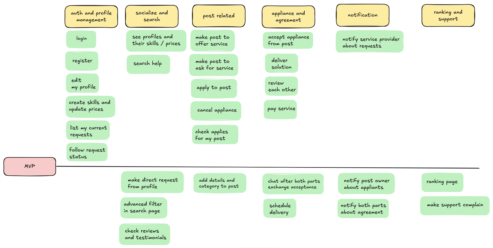

## Project Title: "SkillShare Platform"

Project Description: SSP is an online platform that connects service providers and people who seek help in their personal tech issues. Users can offer services in different skills they share on the platform and apply to posts created by other users who search help. The platform facilitates connection between this two parts, search , payments, reviews, and real-time interactions, providing a comprehensive environment for skill services selling.

## Core features

#### 1. User Authentication and Authorization:

    * Implement user registration and login functionalities.
    * Differentiate access levels for instructors and students.

#### 2. User Profiles:

    * Allow users to create and manage their profiles, including personal information, skills, and fees.
    * Service providers can showcase their expertise and skill offering.

#### 3. post Management:

    * help seekers can manage their posts, view and manage appliants, also can ask help directly from a sp profile.
    * sp can browse, search, and apply in posts to provide services.

#### 4. Payment Integration:

    * Integrate a payment gateway (e.g., Stripe or PayPal) to handle service payments securely.

#### 5. Reviews and Ratings:

    * Enable both parts to leave reviews and ratings for each other after work is done.
    * Display aggregated ratings to inform users about the quality of provided service.

#### 6. Real-Time Communication:

    * Implement a messaging system for communication between parts after accepting to work with each other.
    * real-time chat functionality.

#### 7. Admin Dashboard:

    * Create an admin panel to manage users, posts, and site content.
    * Monitor platform analytics and user activities.

#### 8. follow progress of commands

    * both parts should be able to follow their commands(request help or applied tasks).
    * the ability to cancel command at any time of the process.

#### 9. Responsive Design:

    * Ensure the platform is mobile-friendly and accessible on various devices.

#### 10. Advanced filters and search :

    * Optimize user experience  with an innovative customizable search and filter that allows him to find what he's searching quickly.

#### 11. Notifications:

    * Implement email and in-app notifications for accepting requests , post updates, new messages, and payments.

## Technologies and Tools

#### \* Frontend:

    * Vue.js 3 for building interactive user interfaces.
    * Vue Router for client-side routing.
    * Vuex or Pinia for state management.
    * Tailwind CSS for styling and responsive design.

#### \* Backend:

    * Laravel 11 for handling server-side logic and API development.
    * Laravel Sanctum for API authentication.
    * Eloquent ORM for database interactions.

#### \* Database:

    * MySQL or PostgreSQL for relational data management.

#### \* Real-Time Functionality:

    * Laravel Echo and Pusher for implementing WebSocket communications.

#### \* Payment Processing:

    * Stripe or PayPal SDKs for secure payment transactions.

Development Approach:

## User stories

## User stories MPV Features

