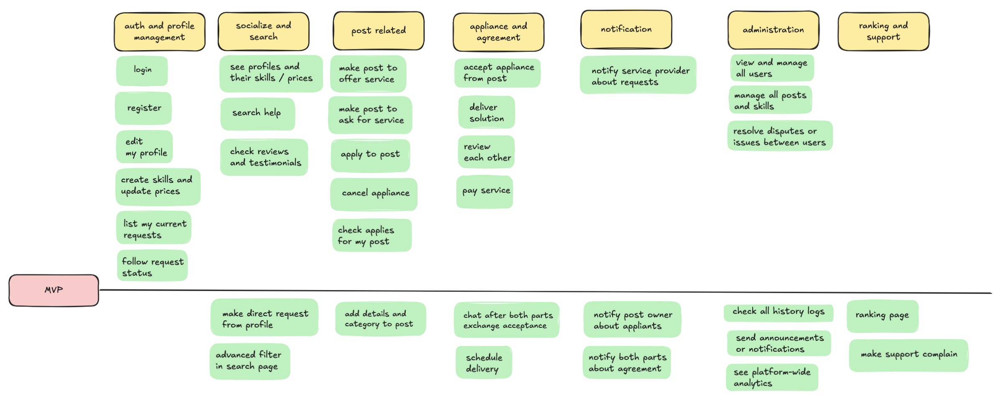

## Project Title: "SkillShare Platform"

Project Description: SSP is an online platform that connects service providers and people who seek help in their personal tech issues. Users can offer services in different skills they share on the platform and apply to posts created by other users who search help. The platform facilitates connection between this two parts, search , payments, reviews, and real-time interactions, providing a comprehensive environment for skill services selling.

## (Business + Functional)

## Core features

#### 1. User Authentication and Authorization:

    * Implement user registration and login functionalities.
    * Differentiate access levels for instructors and students.

#### 2. User Profiles:

    * Allow users to create and manage their profiles, including personal information, skills, and fees.
    * Users can showcase their expertise and skill offering.

#### 3. post Management:

    * users can manage their posts, view and manage applicants, also can ask help directly from a user profile.
    * user can browse, search, and apply in posts to provide services.

#### 4. Payment Integration:

    * Integrate a payment gateway (e.g., Stripe or PayPal) to handle service payments securely.

#### 5. Reviews and Ratings:

    * Enable both parts to leave reviews and ratings for each other after work is done.
    * Display aggregated ratings to inform users about the quality of provided service.

#### 6. Real-Time Communication:

    * Implement a messaging system for communication between parts after accepting to work with each other.
    * real-time chat functionality.

#### 7. Admin Dashboard:

    * Create an admin panel to manage users, posts, and site content.
    * Monitor platform analytics and user activities.

#### 8. follow progress of commands

    * both parts should be able to follow their commands(request help or applied tasks).
    * the ability to cancel command at any time of the process.

#### 9. Responsive Design:

    * Ensure the platform is mobile-friendly and accessible on various devices.

#### 10. Advanced filters and search :

    * Optimize user experience  with an innovative customizable search and filter that allows him to find what he's searching quickly.

#### 11. Notifications:

    * Implement email and in-app notifications for accepting requests , post updates, new messages, and payments.

## Technologies and Tools

#### \* Frontend:

    * Vue.js 3 for building interactive user interfaces.
    * Vue Router for client-side routing.
    * Vuex or Pinia for state management.
    * Tailwind CSS for styling and responsive design.

#### \* Backend:

    * Laravel 11 for handling server-side logic and API development.
    * Laravel Sanctum for API authentication.
    * Eloquent ORM for database interactions.

#### \* Database:

    * MySQL or PostgreSQL for relational data management.

#### \* Real-Time Functionality:

    * Laravel Echo and Pusher for implementing WebSocket communications.

#### \* Payment Processing:

    * Stripe or PayPal SDKs for secure payment transactions.

Development Approach:

## Sketching User stories

## User Stories

👤 User (Help Seeker & Service Provider)

### Authentication & Profile Management

    * As a user, I want to register an account, so that I can access the platform’s features.

    * As a user, I want to log into my account, so that I can manage my services and requests.

    * As a user, I want to edit my profile, so that I can keep my information up to date.

    * As a user, I want to add my skills and set prices, so that people know what services I offer.

### Service & Request Management

    * As a user, I want to see my current service requests, so that I can follow up on their progress.

    * As a user, I want to follow the status of each request (pending, accepted, done), so that I stay informed.

    * As a user, I want to cancel a request or application, so that I can manage my engagements.

    * As a user, I want to receive notifications when someone applies to my post, so that I can respond quickly.

    * As a user, I want to accept an application to my post, so that I can choose who helps me.

    * As a user, I want to deliver a solution after completing a task, so that the request can be marked as complete.

### Discovery & Posting

    * As a user, I want to view other users’ profiles with their skills and prices, so that I can choose the right person to help.

    * As a user, I want to search for specific help based on skill or category, so that I can find the right service fast.

    * As a user, I want to create a post asking for help, so that users can apply to help me.

    * As a user, I want to create a post offering help, so that help seekers can reach out to me.

    * As a user, I want to apply to posts, so that I can offer my services.

    * As a user, I want to see applications to my post, so that I can manage and choose the best one.

### Payments & Reviews

    * As a user, I want to pay for a service once it's completed, so that the provider gets rewarded.

    * As a user, I want to leave a review and rating after a service, so that I can share my experience.

    * As a user, I want to see reviews and testimonials on profiles, so that I can trust the service quality.

### Admin

    * As an admin, I want to view and manage all users, so that I can maintain a safe platform.

    * As an admin, I want to manage all posts and skills, so that inappropriate content is removed.

    * As an admin, I want to see platform-wide analytics, so that I can monitor activity and performance.

    * As an admin, I want to resolve disputes or issues between users, so that trust is maintained.

    * As an admin, I want to send announcements or notifications, so that all users are updated on platform changes.

    * As an admin, I want to check all history logs, so that trust is maintained.

## MVP user stories with acceptance criteria

### Acceptance Criteria: "As a user, I want to register an account."

    * User can register using name, email, and password.

    * Validation errors are shown for invalid/missing data.

    * After registration, user is automatically logged in and redirected to dashboard page.

    * User role defaults to user.

### Acceptance Criteria: "As a user, I want to log into my account."

    * User can log in using email and password.

    * Authentication fails with incorrect credentials.

    * Authenticated users are redirected to the dashboard.

### Acceptance Criteria: "As a user, I want to edit my profile."

    * User can update name, bio, avatar, location, etc.

    * User can see a success message after saving.

    * Only the authenticated user can edit their own profile.

### Acceptance Criteria: "As a user, I want to add my skills and set prices."

    * User can list multiple skills with description and pricing.

    * Each skill must include: title, category, experience level, fee (can be 0).

    * User can update or delete listed skills.

    * Skills appear publicly on user profile.

### Acceptance Criteria: "As a user, I want to see my current requests."

    * User sees a list of requests they’ve made or applied to and even requests that they have received.

    * Each request displays status (Pending, Accepted, Completed).

    * user can see related info to the request , like who made it , date , description...

### Acceptance Criteria: "As a user, I want to follow the status of each request."

    * Request cards display status updates.

    * Status includes: Pending, Accepted, In Progress, Completed, Cancelled.

    * Notification is sent when status changes.

### Acceptance Criteria: "As a user, I want to cancel a request or application."

    * User can cancel request before it's accepted.

    * applicants can cancel an application before acceptance.

    * Cancelled requests are marked and archived (not deleted).

### Acceptance Criteria: "As a user, I want to receive notifications when someone applies to my post."

    * user gets email + in-app notification.

    * Notification includes applicant name and post reference.

    * Notification leads directly to post or applicant’s profile.

### Acceptance Criteria: "As a user, I want to accept an application to my post."

    * user can view all applicants.

    * user can accept only one application per post.

    * Once accepted, request status updates to “In Progress.”

    * Notification is sent to the selected user who has been requested.

### Acceptance Criteria: "As a user, I want to deliver a solution after completing a task."

    * user who provide a service and has accepted a request can mark it as "Delivered."

    * user receives confirmation prompt and can mark as completed or request revision.

    * Once confirmed, task status is updated to “Completed.”

### Acceptance Criteria: "As a user, I want to view other users’ profiles with their skills and prices"

    * users can visit each other profiles , check their services and skills
    * users can ask help directly from someone's profile if they like what he prvides
    * requesting help from a profile is treated the same way other requests are treated

### Acceptance Criteria: "As a user, I want to search for specific help based on skill or category."

    * User can search by keyword, category, or skill.

    * Results include profiles matching filters.

    * Filters update results without reloading the page.

### Acceptance Criteria: "As a user, I want to post a request for help."

    * Request includes title, description, category, urgency, and price range.

    * User can optionally set an availability window (date/time)

    * Only logged-in users can post requests.

    * Post is publicly visible to users after creation.

### Acceptance Criteria: "As a user, I want to create a post offering help"

    * Request includes title, description, category, and skills provided with their price.

    * User can optionally set an availability window (date/time)

    * Only logged-in users can post services.

    * Post is publicly visible to other users after creation.

### Acceptance Criteria: "As a user, I want to apply to posts."

    * User can click “Apply” on a post.

    * Application includes optional message or note.

    * User cannot apply to same post twice.

    * Applied posts show under “My Applications.”

### Acceptance Criteria: "As a user, I want to see applications to my post."

    * User sees list of applicants for each post.

    * Each applicant shows profile preview and skill match.

    * Can view full profile before accepting.

### Acceptance Criteria: "As a user, I want to pay for a service once it’s completed."

    * Payment is only available after request is marked as completed.

    * User can see service fee before confirming payment.

    * Payment success/failure messages are shown.

    * Payment triggers completion status and release to service provider.

### Acceptance Criteria: "As a user, I want to leave a review and rating after a service."

    * Review includes rating (1–5 stars) and comment.

    * Can only leave a review after service is marked “Completed.”

    * One review per service interaction.

    * both users as service provider and help seeker review each other for future trust

### Acceptance Criteria: "As a user, I want to see reviews and testimonials on profiles."

    * Reviews appear on all users profiles.

    * Each review shows author name, stars, and comment.

    * Average rating is calculated and displayed.

### Acceptance Criteria: "As an admin, I want to view and manage all users"

    * Admin can view the list of all users.

    * Admin can search/filter users by name, email, role, or status.

    * Admin can activate, deactivate, or delete user accounts.

    * Admin can view individual user profiles and their activities.

    * Admin is notified when suspicious activity is flagged (a complain is made , a bug is reported...).

### Acceptance Criteria: "As an admin, I want to manage all posts and skills"

    * Admin sees a list of all published posts and shared skills.

    * Admin can search/filter by user, category, or flagged status.

    * Admin can delete or hide any post or skill.

    * Admin can view post/skill details and the associated user profile.

    * Posts/skills reported by users are highlighted for review.

### Acceptance Criteria: "As an admin, I want to see platform-wide analytics"

    * Admin dashboard displays key metrics: new users, total posts, applications, completed services, etc.

    * Data is visualized via charts (daily, weekly, monthly).

    * Admin can filter analytics by time range.

    * Admin sees revenue summaries if payment system is enabled.

### Acceptance Criteria: "As an admin, I want to resolve disputes or issues between users"

    * Admin sees a list of reported issues or disputes.

    * Each dispute contains user details, request details, and issue description.

    * Admin can contact both parties.

    * Admin can take action (e.g., refund, ban, suspend user, mark as resolved).

    * Resolutions are logged for audit purposes.

### Acceptance Criteria: "As an admin, I want to send announcements or notifications"

    * Admin can compose a platform-wide announcement.

    * Announcement can be sent as in-app message, email, or both.

    * Announcement history is saved and viewable.

### Acceptance Criteria: "As an admin, I want to check all history logs"

    * Admin can view logs of user activities (login, request updates, payments, reviews, etc).

    * Logs can be filtered by date, user, or action type.

    * Logs are read-only.

    * Each log includes timestamp, action, user ID, and IP address.
